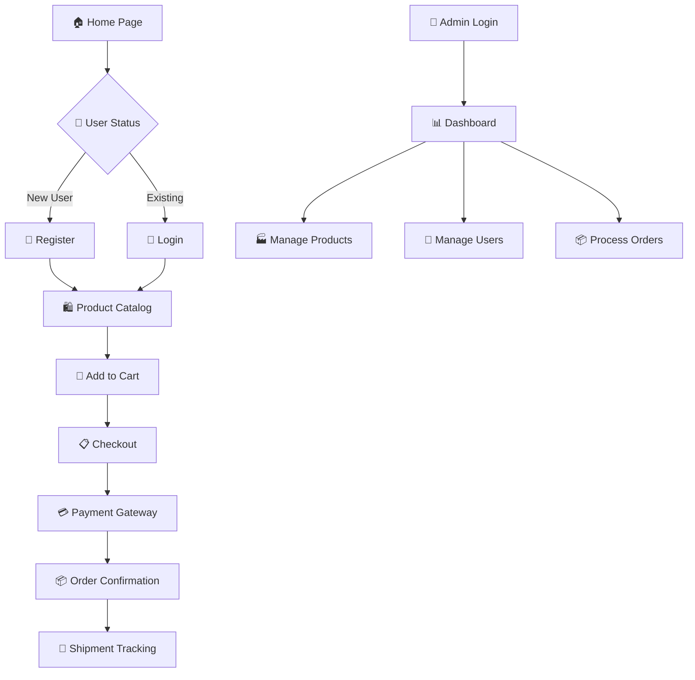

# 🚀 TechCart

> **Next-Generation E-Commerce Platform for Tech Enthusiasts**

<div align="center">

[](https://opensource.org/licenses/MIT)
[](https://nodejs.org/)
[](https://reactjs.org/)
[](https://www.mongodb.com/)
[](https://expressjs.com/)

**Built for Scale • Designed for Performance • Crafted for Excellence**


</div>

---

## 📸 **Screenshots**

<div align="center">

### 🏠 **Home Page**


### 🛒 **Shopping Experience**
<table>
<tr>
<td></td>
<td></td>
</tr>
<tr>
<td align="center"><strong>Product Catalog</strong></td>
<td align="center"><strong>Shopping Cart</strong></td>
</tr>
</table>

### 💳 **Checkout Process**
<table>
<tr>
<td></td>
<td></td>
<td></td>
</tr>
<tr>
<td align="center"><strong>Checkout</strong></td>
<td align="center"><strong>Payment</strong></td>
<td align="center"><strong>Confirmation</strong></td>
</tr>
</table>

### 👑 **Admin Dashboard**
<table>
<tr>
<td></td>
<td></td>
</tr>
<tr>
<td align="center"><strong>Dashboard</strong></td>
<td align="center"><strong>Product Management</strong></td>
</tr>
</table>

### 📱 **Mobile Responsive**
<table>
<tr>
<td></td>
<td></td>
<td></td>
<td></td>
</tr>
<tr>
<td align="center"><strong>Home Screen</strong></td>
<td align="center"><strong>Product Browse</strong></td>
<td align="center"><strong>Shopping Cart</strong></td>
<td align="center"><strong>Checkout</strong></td>
</tr>
</table>

</div>

---

## ✨ **Core Features**

### 🛍️ **Customer Journey**
- **🏪 Product Showcase** → Immersive tech product catalog with advanced filtering
- **🛒 Smart Cart** → Intelligent cart management with real-time price calculations
- **📦 Order Lifecycle** → Seamless checkout → payment → shipping → delivery tracking
- **⭐ Social Proof** → Product reviews and rating system
- **👤 User Portal** → Profile management, order history, wishlist

### 🎛️ **Admin Command Center**
- **📊 Dashboard** → Real-time analytics, sales metrics, performance insights
- **🏭 Product Management** → CRUD operations, inventory control, bulk actions
- **🚚 Fulfillment Center** → Order processing, shipment tracking, delivery management
- **👥 User Administration** → Customer management, role-based access control
- **💰 Financial Overview** → Revenue tracking, payment monitoring

### 🔐 **Enterprise Security**
- **🔑 JWT Authentication** → Stateless, secure token-based auth
- **🛡️ Role-Based Access** → Granular permissions (Admin/Customer)
- **🔒 Data Protection** → Encrypted passwords, secure API endpoints
- **🍪 Session Management** → HTTP-only cookies, CSRF protection

---

## 🏗️ **Architecture Stack**

<table>
<tr>
<td width="50%">

### **Frontend Arsenal**
```javascript
React 18.3.1         // Component library
Redux Toolkit        // State management
React Router Dom     // Client-side routing
Tailwind CSS         // Utility-first styling
Formik + Yup         // Form handling & validation
Axios               // HTTP client
Lucide React        // Icon system
React Toastify      // Notifications
```

</td>
<td width="50%">

### **Backend Infrastructure**
```javascript
Node.js + Express   // Server runtime
MongoDB + Mongoose  // Database & ODM
JWT                // Authentication
bcryptjs           // Password hashing
Cookie Parser      // Session handling
Colors             // Console styling
Dotenv            // Environment config
```

</td>
</tr>
</table>

---

## 🚀 **Quick Deploy**

### **One-Click Setup**
```bash
# 1. Clone & Navigate
git clone https://github.com/sharvil/tech-cart.git && cd tech-cart

# 2. Install Everything
npm install && npm install --prefix frontend

# 3. Environment Setup
echo "NODE_ENV=development
PORT=5002
MONGO_URI=mongodb://localhost:27017/techcart
JWT_SECRET=$(openssl rand -base64 32)
PAYPAL_CLIENT_ID=your_paypal_client_id" > .env

# 4. Seed Database
npm run data:import

# 5. Launch Application
npm run dev
```

### **Production Deployment**
```bash
npm run build    # Build optimized bundle
npm start       # Launch production server
```

---

## 📋 **Available Scripts**

| Command | Description | Environment |
|---------|-------------|-------------|
| `npm run dev` | 🔥 **Hot reload** - Frontend + Backend | Development |
| `npm run server` | ⚡ **Backend only** - API server | Development |
| `npm run client` | 🎨 **Frontend only** - React app | Development |
| `npm start` | 🚀 **Production** - Optimized build | Production |
| `npm run build` | 📦 **Build** - Create production bundle | Build |
| `npm run data:import` | 📊 **Seed** - Import sample data | Database |
| `npm run data:destroy` | 🗑️ **Clean** - Reset database | Database |

---

## 🌐 **Application Flow**



---

## 🎯 **Key Endpoints**

### **Customer API**
```http
POST   /api/auth/login           # 🔐 User authentication
POST   /api/auth/register        # 📝 New user signup
GET    /api/products             # 📱 Product catalog
POST   /api/orders               # 🛒 Place order
GET    /api/orders/mine          # 📋 User orders
PUT    /api/users/profile        # 👤 Update profile
```

### **Admin API**
```http
POST   /api/products             # ➕ Create product
PUT    /api/products/:id         # ✏️ Update product
DELETE /api/products/:id         # 🗑️ Delete product
GET    /api/orders               # 📦 All orders
PUT    /api/orders/:id/ship      # 🚚 Mark as shipped
GET    /api/users                # 👥 All users
```

---

## 💡 **Payment Integration Notice**

> **⚠️ Payment Gateway Status**
> 
> Payment integration infrastructure is **ready** but **disabled** to prevent accidental charges during development. The system includes:
> 
> - PayPal SDK integration (`@paypal/react-paypal-js`)
> - Secure payment flow architecture
> - Order processing pipeline
> - Transaction logging system
> 
> **To enable payments:** Configure your PayPal Client ID in environment variables

---

## 📁 **Project Structure**

```
tech-cart/
├── 📸 screenshots/              # Project images & demos
│   ├── demo.gif                # Main demo video
│   ├── homepage.png            # Landing page
│   ├── products.png            # Product catalog
│   ├── cart.png                # Shopping cart
│   ├── checkout.png            # Checkout process
│   ├── payment.png             # Payment page
│   ├── order-confirmation.png  # Order success
│   ├── admin-dashboard.png     # Admin overview
│   ├── admin-products.png      # Product management
│   └── mobile-views.png        # Mobile responsive
├── 🎨 frontend/                 # React application
│   ├── src/
│   │   ├── components/         # Reusable UI components
│   │   ├── pages/             # Route components
│   │   ├── store/             # Redux store & slices
│   │   ├── services/          # API service layer
│   │   └── utils/             # Helper functions
│   └── public/                # Static assets
├── ⚡ backend/                  # Express server
│   ├── controllers/           # Route handlers
│   ├── models/               # MongoDB schemas
│   ├── routes/               # API endpoints
│   ├── middleware/           # Custom middleware
│   └── utils/                # Server utilities
└── 📦 package.json            # Project configuration
```

---

## 📷 **Adding Screenshots**

Create a `screenshots/` folder in your project root and add these images:

### **Required Images:**
```bash
screenshots/
├── demo.gif                    # 🎬 Main demo (optional)
├── homepage.png               # 🏠 Landing page
├── products.png               # 📱 Product listing
├── cart.png                   # 🛒 Shopping cart
├── checkout.png               # 💳 Checkout flow
├── payment.png                # 💰 Payment page
├── order-confirmation.png     # ✅ Success page
├── admin-dashboard.png        # 📊 Admin overview
├── admin-products.png         # 🏭 Product management
└── mobile-views.png           # 📱 Mobile screens
```

### **Pro Tips:**
- **Use high-quality screenshots** (1920x1080 recommended)
- **Show real data** instead of placeholder content
- **Include both light/dark themes** if applicable
- **Capture mobile responsiveness**
- **Create animated GIFs** for user flows
- **Optimize images** for web (compress without quality loss)

---

## 🤝 **Contributing**

We welcome contributions! Please see our [Contributing Guidelines](CONTRIBUTING.md) for details.

1. **Fork** the repository
2. **Create** a feature branch (`git checkout -b feature/AmazingFeature`)
3. **Commit** changes (`git commit -m 'Add AmazingFeature'`)
4. **Push** to branch (`git push origin feature/AmazingFeature`)
5. **Open** a Pull Request

---

## 📄 **License**

This project is licensed under the **MIT License** - see the [LICENSE](LICENSE) file for details.

---

## 👨‍💻 **Author**

**Sharvil Shetty**
- 🌟 Full-Stack Developer
- 💼 E-commerce Architecture Specialist

---

<div align="center">

**⭐ Star this repo if you find it useful!**

Made with ❤️ by [Sharvil Shetty](https://github.com/sharvil)

</div>
